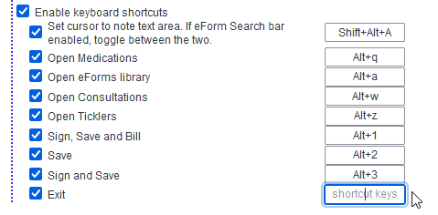
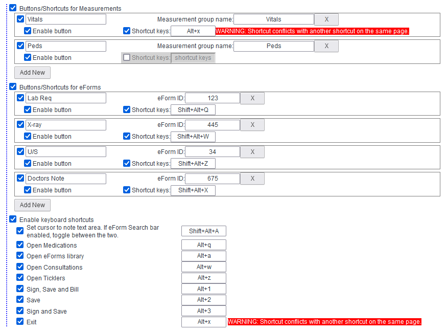
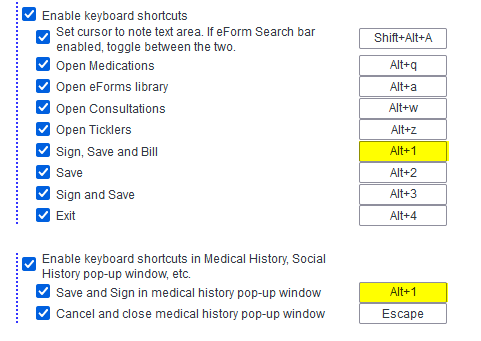

# Keyboard shortcuts:

## To set shortcuts
- place your cursor in the box for the shortcut that you want to change. Then type your shortcut. Then click outside of the box. 

## To remove shortcuts
- place your cursor in the shortcut box. Then Press Backspace. Then click outside of the box. 
  - Clicking "Delete" or "Escape" will NOT work. Instead, these will be bound as a shortcut key.

## Shortcut groups
- Keyboard shortcuts are grouped based on the page in which they're active. If there are conflicting shortcuts, warning text will appear.
- The blue dotted line on the left margin denotes the shortcuts that are in the same shortcut group. Shortcuts that are the same between two different shortcut groups will be fine.
- For example: 
  - in the E-Chart section, the long blue dotted line means all these shortcuts are in the same shortcut group. Which means any duplicated keyboard shortcuts will cause a conflict. For example, the shortcut for Vital measurement and the shortcut to exit are in the same shortcut group. If they are both set to Alt+x, there will be a conflict. We know they're in the same shortcut group because they are connected by the same dotted line.
  

  - In contrast, the separate, shorter blue dotted line denotes another shortcut group. Note that “Save and Sign in medical history pop-up window” and “Sign, Save and Bill” both have the same keyboard shortcut of Alt+1. But there is no conflict because they are in different shortcut groups. We know this because they are not connected by the same dotted line.

- Basically, if different shortcuts are used in separate windows/pages (or in a separate pop-up window), these shortcuts are likely to be in different shortcut groups and there will be no conflict.

## Page-specific notes
- Inbox Result: When in an inbox result that is an embedded document, such as a consult note, keyboard shortcuts will only work if the focus is NOT on the embedded document, but rather the reset of the page that forms a frame around the embedded PDF. To change the focus, just click above (or below, or the little sliver to either side) the frame of the embedded document.

## Other notes
- The keyboard shortcuts are sensitive to CapsLock. Make sure CapsLock is not turned on if you're having issues with keyboard shortcuts.

